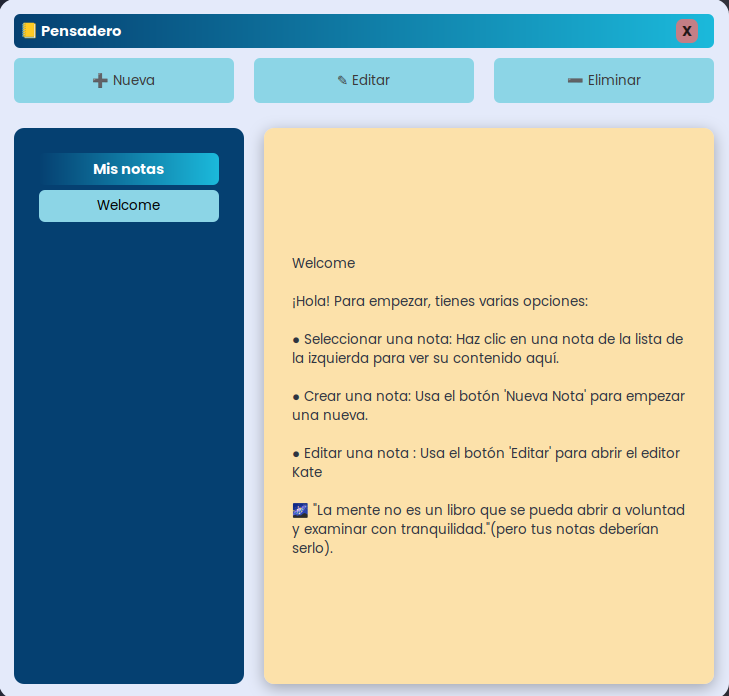

# Pensadero


Un **widget ligero de notas de escritorio** construido con **EWW** y **Python**.  
"La mente no es un libro que pueda abrirse a voluntad y examinarse a placer"
Pero tus notas, sí 😉

---

## 🌟 Características

- **Crear, editar y eliminar notas** directamente desde el widget.  
- **Soporte para múltiples notas** — organiza tus ideas por separado.  
- **Almacenamiento persistente** usando [XDG Base Directory](https://specifications.freedesktop.org/basedir-spec/basedir-spec-latest.html), lo que facilita el respaldo.  
- **Interfaz limpia y minimalista**, con lista de notas desplazable.  
- **Ligero y rápido**, sin dependencias pesadas.  

---

## 📸 Capturas de pantalla

### Interfaz principal


---

## 🛠️ Instalación

### Requisitos
- [EWW](https://elkowar.github.io/eww/)  
- Python 3.9+  
- Linux (probado en OpenSUSE Tumbleweed - Slowroll, debería funcionar en la mayoría de distribuciones).  

### Configuración
Clona el repositorio y muévete a la carpeta del proyecto:

```bash
git clone https://github.com/tu-usuario/pensadero.git
cd pensadero
```

Asegúrate de tener EWW instalado y en ejecución:
```bash
eww daemon
```
Luego abre el widget

```bash
eww open notes_window
```
## ¿Cómo funciona?
- Frontend: `EWW` maneja la interfaz (lista de notas, botones, inputs).

- Backend: `Python` administra las operaciones de notas (crear, editar, eliminar, mostrar contenido).

- Almacenamiento: las notas se guardan en `$XDG_CONFIG_HOME/pensadero/` para mayor portabilidad.

## 🤝 Contribuciones
Este widget fue diseñado para uso personal asi que ¡Las ideas y mejoras son bienvenidas!
Abre un issue o envía un pull request.